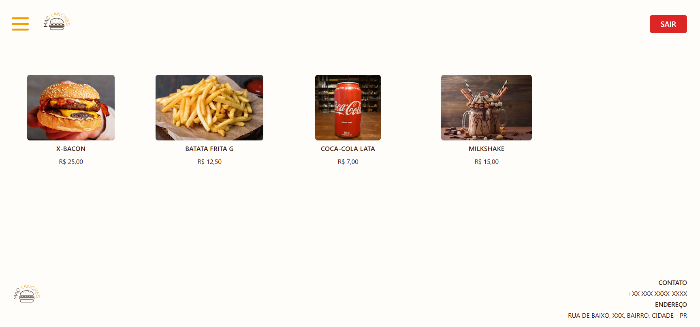
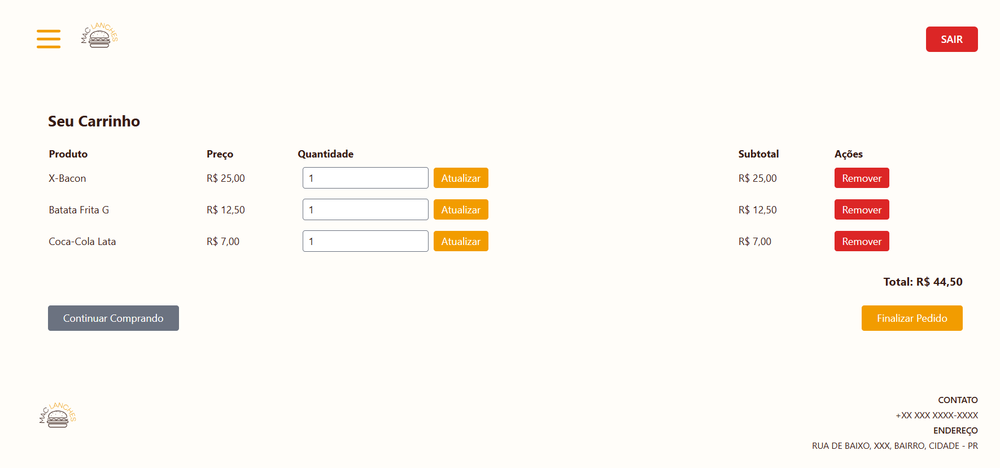

# MAC LANCHES

O MAC LANCHES é um MVP de um sistema de gerenciamento de pedidos e cardápio desenvolvido para lanchonetes. Ele permite que um administrador crie e gerencie o cardápio, e também controle o fluxo de pedidos dos clientes, desde o recebimento até a entrega.

Este projeto está sendo desenvolvido como parte da disciplina de Desenvolvimento de Aplicações Backend com Framework na UTFPR (2025.1), sob a orientação do Professor Andres Jesse.

## 🖼️ Tela Principal



## 🖼️ Carrinho



## Ambiente de desenvolvimento e ferramentas

Esse repositório foi desenvolvido com as seguintes ferramentas:

-   Linguagem de Programação: PHP
-   Framework: Laravel
-   Banco de Dados: SQLite

### Ferramentas de Frontend:

-   Blade
-   Tailwind CSS
-   Vite

### Outras Ferramentas:

-   Composer

## 🚀 Como Rodar o Projeto Localmente

> Siga os passos abaixo no terminal:

```bash
git clone https://github.com/Ismael-Albuquerque/mac-lanches.git
cd mac-lanches
composer install
cp .env.example .env
php artisan key:generate
touch database/database.sqlite
php artisan migrate --seed
php artisan serve
```

Acesse: http://localhost:8000

## Funcionalidades a serem implementadas

-   Exibição do Cardápio; (PRIORITÁRIA)
-   Gerenciamento de Produtos (CRUD para Administrador); (PRIORITÁRIA)
-   Sistema de Pedidos (Lado do Cliente); (PRIORITÁRIA)
-   Gerenciamento de Pedidos (Lado do Administrador/Cozinha); (TRABALHOS FUTUROS)

### Observações:

-   Link para o protótipo de telas: https://www.figma.com/design/sSDi620SNUJKnU4aNlIyqb/MAC-Lanches?m=auto&t=iP3F9w9VFzu8Apif-1
-   Link para a modelagem do banco de dados: https://drive.google.com/file/d/1p-L4FFxY8SgCGnf9xQSA-7aMm-pIlrMX/view?usp=drive_link

## Planejamento de sprints:

### Semana 1:

-   Setup do Ambiente e Base do Cardápio
    -   [DONE] Criar projeto.
    -   [DONE] Instalar bibliotecas necessárias.
    -   [DONE] Modelar o banco de dados SQLite e configurar no .env e criar o arquivo database.sqlite.
    -   [DONE] Definir as rotas básicas para a página inicial (cardápio) e uma página de detalhes de produto.
    -   [DONE] Criar migração para a tabela products (nome, descrição, preço, image_path).
    -   [DONE] Criar as views Blade (index.blade.php e show.blade.php) para exibir o cardápio e detalhes.
    -   [DONE] Estilizar o index.blade.php com TailwindCSS.

### Semana 2:

-   Gerenciamento Básico de Produtos (Admin)
    -   [DONE] Implementar rotas e views para criar e editar produtos.
    -   [DONE] Criar formulários Blade para adição e edição de produtos.
    -   [DONE] Implementar a validação inicial dos formulários de produto.
    -   [DONE] Criar um seeder para popular alguns produtos no banco de dados.
    -   [DONE] Criar um usuário administrador.
    -   [DONE] Implementar login e logout básicos para o administrador (Autenticação).
    -   [DONE]Proteger as rotas de gerenciamento de produtos com o middleware 'auth'.

### Semana 3:

-   Funcionalidade de Carrinho e Persistência de Pedidos
    -   [DONE] Criar as tabelas orders e order_items com suas migrações.
    -   [DONE] Definir os relacionamentos: Order com User, Order com Order_Item, Product com Order_Item (um-para-muitos).
    -   [DONE] Implementar a lógica de adição de produtos ao carrinho (pode ser via sessão ou banco de dados).
    -   [DONE] Criar rotas e views para a página do carrinho, exibindo os itens e o subtotal.
    -   [DONE] Criar a rota e view para o checkout com formulário.
    -   [DONE] Implementar a lógica para persistir um pedido finalizado no banco de dados.

### Semana 4 - TRABALHOS FUTUROS:

-   Gerenciamento de Pedidos (Admin) e Seeders/Factories
    -   [] Criar rotas e views para listar todos os pedidos (/admin/orders).
    -   [] Criar uma view para os detalhes de um pedido específico, incluindo os itens e dados do cliente.
    -   [] Implementar funcionalidade para atualizar o status do pedido (ex: "Pendente", "Em Preparo", "Concluído", "Cancelado").
    -   [] Garantir que apenas usuários autenticados (administradores) acessem essas rotas.
    -   [] Criar Factories para Order e OrderItem para facilitar testes e seeders.
    -   [] Criar seeders para gerar pedidos de exemplo no banco de dados.

### Semana 5 - TRABALHOS FUTUROS:

-   Autorização com Policies
    -   [] Implementar Policies para Product (apenas admin pode criar/editar/deletar).
    -   [] Implementar Policies para Order (cliente só pode ver/cancelar seus próprios pedidos; admin pode ver/gerenciar todos).
    -   [] Aplicar as regras de autorização nos Controllers e/ou nas Form Requests.
    -   [] Escrever testes de feature específicos para verificar as regras de autorização (ex: um não-admin tentando criar um produto).

### Semana 6 - TRABALHOS FUTUROS:

-   Upload de Imagens de Produtos
    -   [] Atualizar a migração da tabela products para incluir um campo image_path (se não fez na Sprint 1).
    -   [] Configurar o sistema de Storage do Laravel (armazenamento local).
    -   [] Implementar a funcionalidade de upload de imagens ao criar/editar produtos (formulário, controller).
    -   [] Exibir as imagens no cardápio e nos detalhes do produto.
    -   [] Implementar a exclusão da imagem ao deletar o produto ou ao atualizar por uma nova.

### Semana 7 - TRABALHOS FUTUROS:

-   Ajustes Finais, Refatoração e Documentação
    -   [] Realizar ajustes finais na interface do usuário.
    -   [] Revisar o código e adicionar comentários onde necessário.
    -   [] Otimizar queries do banco de dados.
